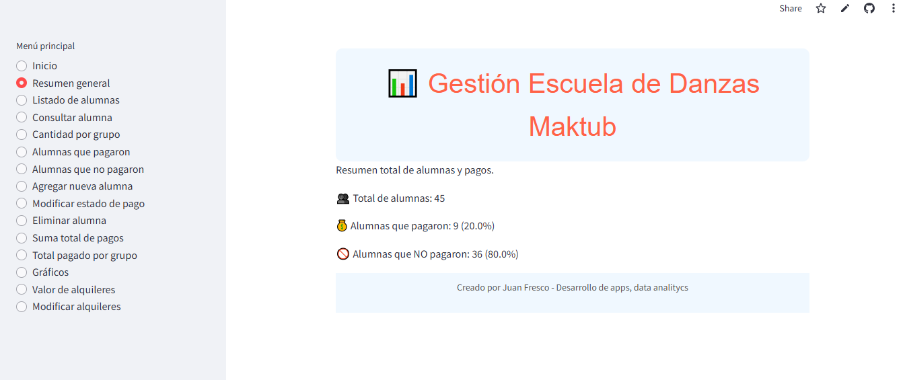

# Aplicación de Gestión de Alumnas - Maktub

Aplicación web desarrollada en **Streamlit** para la gestión integral de alumnas, pagos y grupos en una escuela de danzas.

Fue creada para cubrir una necesidad real de la escuela de danzas **Maktub**, brindando una solución práctica, simple y accesible para la administración de pagos y asistencia.

## 📸 Captura de Pantalla



## 🚀 Instalación local

Sigue estos pasos para ejecutar la aplicación en tu máquina local:

1. Clona el repositorio:
   ```bash
   git clone https://github.com/juanfrescodev/app-maktub.git
   cd app-maktub

2. Crea un entorno virtual (opcional pero recomendado):

bash
Copiar
Editar
python -m venv venv
source venv/bin/activate   # En Windows usa `venv\Scripts\activate`

3. Instala las dependencias:

bash
Copiar
Editar
pip install -r requirements.txt

4. Ejecuta la aplicación:

bash
Copiar
Editar
streamlit run app.py
Esto abrirá la aplicación en tu navegador.


## 🌐 Acceso Online
Puedes acceder a la versión en línea de la aplicación sin necesidad de instalar nada desde el siguiente enlace:
https://maktubapp.streamlit.app/

Desde la versión web podrás utilizar todas las funcionalidades de la aplicación de manera completa.

## 📦 Dependencias principales
Streamlit: Framework para crear aplicaciones web interactivas.

Pandas: Manejo y análisis de datos.

Datetime: Manejo de fechas y tiempos.

OS: Interacción con el sistema operativo.

Plotly: Visualización de datos en gráficos interactivos.

Gspread: Interacción con Google Sheets.

## 💡 Características
Consultar alumna: Permite ver estado de pago e historial de una alumna seleccionada.

Agregar nueva alumna: Permite agregar nuevas alumnas al sistema.

Modificar Estado de Pago: Actualiza el estado de pago de las alumnas y su historial.

Visualización de Datos: Muestra tablas y gráficos de pagos.

Eliminar alumna: Permite eliminar alumnas del sistema.

Modificar alquileres: Permite modificar el valor de los alquileres de salones utilizados.

## 🛠 Autor
Juan Fresco
Desarrollador de soluciones digitales y automatización.
https://github.com/juanfrescodev


